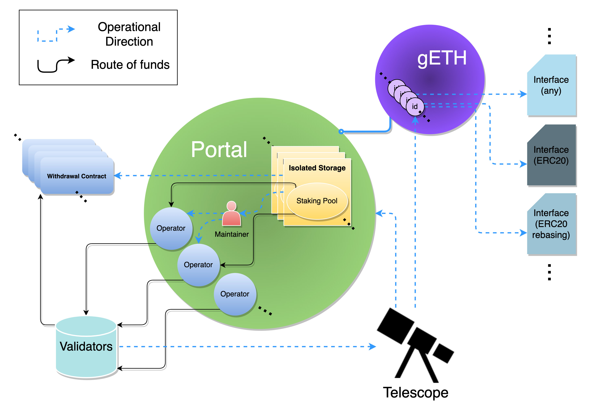
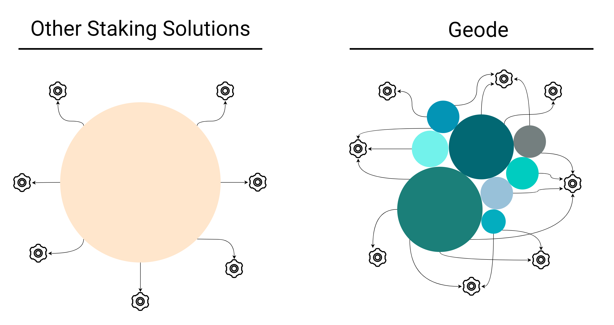

# Geode Document Hub

#### <mark style="color:red;">Secure Code, Decentralized Library, Future of Staking.</mark>

A secure global standard that allows anyone to create and maintain **their own Permissionless, Trustless Staking Solution** on the Ethereum Blockchain.

The Staking Library is maintained by the Geode Finance Governance, and secured by pool owners via a Dual Governance.

## <mark style="color:purple;">A Challenging Mission</mark>



Linus Torvalds was bothered by the centralization and monopolization of the operating systems. So he created Linux.

Satoshi Nakamoto was bothered by the centralization and monopolization of traditional monetary systems. So he created Bitcoin.

_Do we stop now?_

## <mark style="color:purple;">Why Geode?</mark>

Geode is revolutionizing the understanding behind Staking Derivatives by granting **any centralized or decentralized** entities the ability to run their own solution **without intermediaries**.

* A standard for staking pools and derivatives.
* A standard for the communication between Node Operators and Staking Pools.

### Unlock Unlimited Potential.

Thanks to the Modular Architecture of the **Configurable Staking Pools,** everything about staking is within reach.

<figure><figcaption>
Modular Architecture
</figcaption></figure>

* Save the cost of maintenance on multiple levels.
* Provide better yield bearing mechanisms for your community.
* Increase your TVL by offering Liquid Staking.
* Integrate your own derivative into your products or create new products with it.
* Generate remarkable and sustainable revenue with a pool maintenance fee.
* Fully segregated staking, providing better security and enables you to perform KYC & AML
* Create auto-staking contracts!
* Stake and forget.


[the-staking-library](the-staking-library/)


### Remove tail risk.

Third party Staking Derivatives expose tail risk to the whole staking ecosystem.

Geode allows any party to manage its own risk profile.

**Thanks to **<mark style="color:purple;">**Contract Owned Staking Derivatives**</mark>** you don't need the middleman anymore.**&#x20;

**Craft your own solution instead.**

<figure><figcaption>
Isolated risk.
</figcaption></figure>

* Manage your risk profile by simply reaching out to Solo/Industrial Node Operators directly via our marketplace
* Have complete ownership of your staking pool, control the Withdrawal Contract and have total ownership over your funds


[operator-marketplace](operator-marketplace/)


## <mark style="color:purple;">Start Building!</mark>

Invest your time on improving your protocol, instead of building out your own Staking solution.

We got you on that:

* Geode Portal is secured by Dual Governance and Limited Upgradability!
* Guard your Withdrawal Contract with upgradeProposals!
* Automate your workflow with Maintainers!
* Build on top of your Staking Derivative with Interfaces!


[staking-pool-handbook.md](avalanche-guides/staking-pool-handbook.md)


## <mark style="color:purple;">The Future of Geode</mark>

We aim to establish the best user experience for Stakers, Pool Owners, an d Node Operators.

We considered every little detail, and created a firm frame by utilizing a Modular Architecture.

**Now, it is time to build on top of it:**

* **More Interfaces**
* **Better Maintainers**
* **Improved Features**
* **Further Decentralization**&#x20;


[future-of-geode](key-concepts/future-of-geode/)

