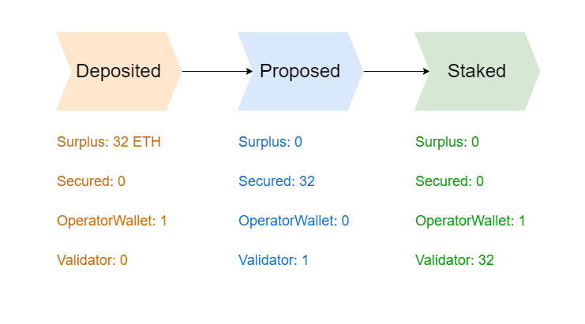

# Creating Validators

<figure><figcaption></figcaption></figure>


[a-validators-lifecycle.md](../../operator-marketplace/a-validators-lifecycle.md)


## 0.1. Create a pool - optional

It might take some time for other pools to give you an allowance.

It is best to create some pools to start testing immediately.

We will provide some Goerli Ether upon onboarding.

#### Create a basic pool easily:


[initiating-a-customizable-staking-pool.md](../staking-pool-handbook/initiating-a-customizable-staking-pool.md)


#### Give Yourself allowance:


[managing-your-operator-set.md](../staking-pool-handbook/managing-your-operator-set.md)


## 0.2 Fund Your Wallet

### Internal Wallet

Every ID has an Internal Wallet, which makes transferring Ether easier for both Geode's Portal, and it's users.


The Internal Wallet is the place where your fees will accrue over time.


Because of [the bug explained here](https://medium.com/immunefi/rocketpool-lido-frontrunning-bug-fix-postmortem-e701f26d7971), you will need **1 Ether per validator proposal** available in your internal wallet.

<mark style="color:purple;">You will be reimbursed after activating the validator.</mark> However, this amount limits how many proposals you can have at the same time.


If you have 100 Ether in your internal wallet, and if it takes 1 day for proposals to be approved:

* You can propose 100 validators a day.


<pre class="language-javascript"><code class="lang-javascript"><strong>await Portal.increaseWalletBalance(id, {value: 100 eth});
</strong></code></pre>

#### Check Your Wallet Balance

```javascript
const balance = Portal.readUintForId(operatorId, getBytes("wallet"))
```

## 1. Pre-Proposal Checks&#x20;


<mark style="color:red;">It is probably a good idea to initiate a couple staking pools and distribute your Goerli Funds among them, Someone else giving you allowance can take some time otherwise.</mark>&#x20;


#### Get the list of all Staking Pools:

<pre class="language-javascript"><code class="lang-javascript"><strong>const all_pool_ids_list = Portal.allIdsByType(5, index);
</strong></code></pre>

> Alternatively you can listen for **`OperatorApproval(indexed poolId,indexed yourId, amount);`**

#### Check Allowances

<pre class="language-javascript"><code class="lang-javascript"><strong>const allowance = Portal.readUintForId(
</strong><strong>    poolId,
</strong><strong>    Portal.getKey(
</strong><strong>        operatorId, 
</strong><strong>        getBytes32("allowance")
</strong><strong>    ));
</strong><strong>
</strong><strong>const proposedValidators = Portal.readUintForId(
</strong>    poolId,
    Portal.getKey(
        operatorId, 
        getBytes32("proposedValidators")
    ));

const activeValidators = Portal.readUintForId(
    poolId,
    Portal.getKey(
        operatorId, 
        getBytes32("activeValidators")
    ));
</code></pre>

> You can create new validators if <mark style="color:purple;">allowance is</mark> <mark style="color:purple;"></mark><mark style="color:purple;">**greater than**</mark> <mark style="color:purple;">`proposedValidators`</mark> <mark style="color:purple;">**+**</mark> <mark style="color:purple;">`activeValidators`</mark><mark style="color:purple;">.</mark>

#### Check Surplus

<pre class="language-javascript"><code class="lang-javascript"><strong>const surplus = Portal.readUintForId(poolId, getBytes("surplus"))
</strong></code></pre>

> Every 32 ETH in surplus means 1 potential validator.

#### Join the Race

When enough funds are pooled for a new validator, you will need to be faster than the other Operators with enough allowance.&#x20;

If you are the only Operator of the pool, you can take your time.

Otherwise, automate your tasks to be faster and capture the validator, or you will need to wait for another 32 Ether.

## 2. Proposing New Validators

### Get withdrawalCredential

It is very important for you to use pool specific withdrawalCredentials in your validators. Otherwise, your proposal will not be approved!

```javascript
await PORTAL.readAddressForId(
  id,
  getBytes32("withdrawalContract")
);

// or

await PORTAL.readBytesForId(
  id,
  getBytes32("withdrawalCredential")
);
```

### Staking Deposit Cli

We have forked the Ethereum's to add --amount parameter.

Using this CLI instead of the original one will allow you to customize the amount parameter:



<pre class="language-bash"><code class="lang-bash">git clone https://github.com/Geodefi/staking-deposit-cli.git
cd staking-deposit-cli/
python3 -m pip3 install virtualenv
python3 -m virtualenv venv
source venv/bin/activate
python3 setup.py install
<strong>python3 -m pip3 install -r requirements.txt
</strong></code></pre>

### Create deposit data

Call these&#x20;

For signatures1:

* create with a new-mnemonic OR use an existing mnemonic but be careful with validator index.
* set --eth1\_withdrawal\_address  to withdrawalContract
* amount is 1

```bash
python3 ./staking_deposit/deposit.py new-mnemonic --num_validators=x --amount=1 --chain=prater --eth1_withdrawal_address 0xc82Ed5eC571673E6b18c4B092c9cbC4aE86C786e 
```

For signatures31:

* use the same mnemonic while creating signatures1.
* use the same validator index (0 if the same time).
* specify the amount of validators with --num\_validators
* use the same --eth1\_withdrawal\_address
* amount is 31

```
python ./staking_deposit/deposit.py existing-mnemonic --num_validators=x --amount=31 --mnemonic_language=english --chain=prater --eth1_withdrawal_address 0xc82Ed5eC571673E6b18c4B092c9cbC4aE86C786e
```

* Pubkeys of the deposit data files should match.

### Propose!

```solidity
Portal.proposeStake(
    uint256 poolId,
    uint256 operatorId,
    bytes[] calldata pubkeys,
    bytes[] calldata signatures1,
    bytes[] calldata signatures31
    ) 
```

* **signatures1**: signature that will be used while proposing validators, _sending 1 Ether to Deposit Contract._
* **signatures31**: signature that will be used while activating validators, _sending 31 Ether to Deposit Contract._

## 3. Check if You Can Stake for Your Proposal:

```javascript
await Portal.canStake(pubkey);
```

It takes less than 24 hours for the Beacon Chain and our Oracle to verify a proposal.

## 4. Batch Validator Activation!

If your proposal is approved, you can use the pooled funds. However, you can save gas by doing Batch Activations:

```solidity
Portal.beaconStake(uint256 operatorId, bytes[] calldata pubkeys);
```


**Save gas cost:**

Pub-keys should be arranged by pool ids.&#x20;

For example: pub-keys = \[pk1, pk2, pk3, pk4, pk5, pk6, pk7]

* pk1, pk2, pk3 from pool1
* pk4, pk5 from pool2
* pk6 from pool3

Etc.

