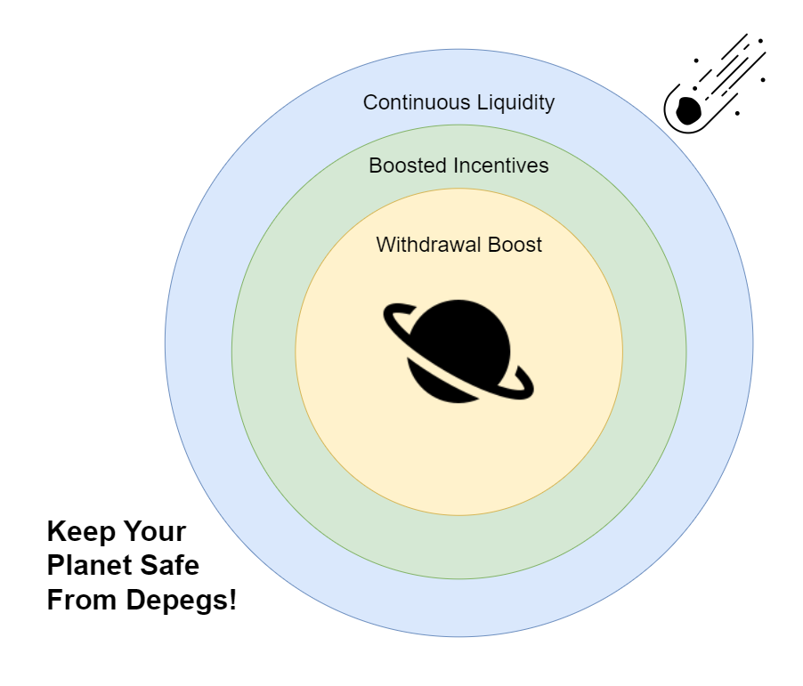

# 🌊 Bound Liquidity Pools

#### Geode Finance provides an optional B**ound** Liquidity Pool to any Staking Pool utilizing The Staking Library.

### One Transaction To Rule Them All

Creating a liquidity pool is not a separate and time consuming process. Anyone can optionally create a bound liquidity pool within the same transaction used to create their staking pool.&#x20;

<figure><figcaption></figcaption></figure>

## <mark style="color:purple;">Optimized</mark>

Geode's Liquidity Pools are optimized for staking derivatives:

### Better Pricing

Geode's liquidity pools provide better pricing by utilizing a **stableswap pool with a dynamic peg.** Meaning instead of using a pricing algorithm for the derivatives, it uses an algorithm for the underlying Ether.

### Peg Protection

When your staking derivative has a bound liquidity pool, Portal checks if there is a better price on the market before minting any new tokens.&#x20;

Preventing any supply increase without balancing the demand, while giving your stakers a better price.

### Easy Routing

Using Geode Finance's liquidity pool allows your stakers to move their funds between different staking derivatives in just one transaction, with minimal slippage.

## <mark style="color:purple;">No Admin Fees</mark>

Conventional stableswap pools charge an admin fee up to 50%, meaning only 0.02% of 0.04% is shared with the LPs.

Geode Finance doesn't collect any admin fees on their liquidity pools.

#### 100% Higher APR

Geode gives all of the 0.04% fee to the Liquidity Providers, resulting in a 100% increase on the base APR.

## <mark style="color:purple;">Future Utilities</mark>

The Geode team is constantly working on improving The Staking Library with more functionalities.

There are many features that might require having a bound liquidity pool in the future.

If your pool has a bound liquidity pool, your stakers will be able to utilize these, and many other futures instantly.

**Such as:**


[synthetic-liquidity-wip.md](future-of-geode/synthetic-liquidity-wip.md)



[dynamic-withdrawals-wip.md](future-of-geode/dynamic-withdrawals-wip.md)


## <mark style="color:purple;">Learn More:</mark>


[liquidity-pool-handbook.md](../ethereum-guides/liquidity-pool-handbook.md)

