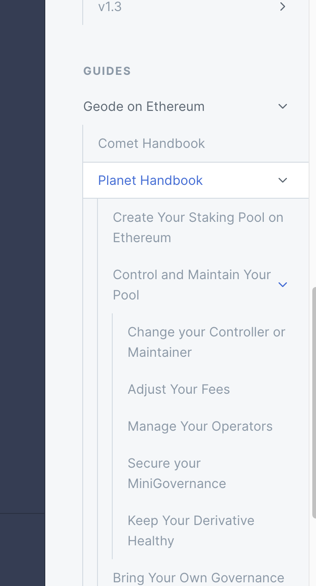

# Dynamic Withdrawals (WIP)


Utilizing this feature will require **supporting EIP-4788**



[supporting-eip-4788-draft.md](further-decentralization/supporting-eip-4788-draft.md)



Utilizing this feature will require a **Bound Liquidity Pool**.


## **Traditional Approach to Withdrawals**

<figure><figcaption></figcaption></figure>

**The traditional Staking process establishes 3 states with Staking/Unstaking functionalities from the perspective of the Staking Pool:**&#x20;

1. Liquid State&#x20;
2. **Locked State**&#x20;
3. Withdrawn State&#x20;

There are some ideas that aim to solve the problem of liquidity on Locked State for a staking derivative. For example, a Staking Pool can set aside a portion of the issued asset to allow withdrawals up to that amount... However, it is obvious that this method is not yield friendly since there will be idle tokens which aren't generating yield. Also determining how much liquidity should be kept is problematic, since there is no way to foresee the exact amount that stakers want to unstake.

Alternatively, there can be a withdrawal mechanism that requires a waiting period to be fulfilled, however forcing users to wait for their funds results in a poor user experience. Also, there is a risk that no funds will be available until the Locked State is finalized. As seen above, there is no way to have a liquid derivative that always fulfils a withdrawal request.&#x20;

## Dynamic Withdrawals

<figure><figcaption></figcaption></figure>

Dynamic Withdrawals can be summarized as a decentralized stable-price liquidity pool designed to allocate any amount of requests instantly. When any of the funds are in the Withdrawn or Liquid State, withdrawal is finalized with a buy-back & burn, which **heals the price as a result**.&#x20;

Any withdrawal request would result in a slippage and a Withdrawal pool fee to be paid to the Liquidity Providers of the pool. Additionally, because the withdrawals are finalized by the state of the Staking Pool, with a guaranteed buy-back\&burn on the mentioned withdrawal pool, the price will be healed in a short amount of time. <mark style="color:purple;">Thereby, any request with excessive amounts should be spread over time</mark>, which is absolutely shorter than the initial Locked Period. Thus, **creating an equilibrium between price, amount and time**.&#x20;

As a result there is 3 States for a Dynamic Staking Pool:&#x20;

1. **Growth Period**: the price is stable, StakingPool has 0 debt to the withdrawal pool, new validators are created with the surplus.&#x20;
2. **Stable Phase**: there is little to no debt or surplus in the staking pool. No new Validators are created.&#x20;
3. **Resurrection Phase**: there is a price gap, resulting in a substantial debt for the Staking Pool. Validators are unstaked to pay the debt and heal the price.&#x20;

It should be noted that there can be multiple phases in a day but the Resurrection Phase can not continue more than the Lock Period. Even in the long Resurrection Phases, there will be a Stable Phase whenever the Node Operator responds. Finally, since the debt is known by the Pool’s Node Operator there is no need to create unnecessary transactions to move the funds between different subchains. This is another benefit of this method that applies specifically to the Avalanche Blockchain.
