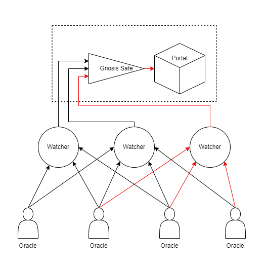

# 🔭 Oracles

## <mark style="color:purple;">Telescope Powers the Staking Universe</mark>


This implementation of oracle utilizes the Gnosis Safe Contracts. To understand how multi-signature works, and to get better insight about quorum please read the [Gnosis Safe Documentation](https://docs.gnosis-safe.io/).&#x20;



For more technical context, please review the Telescope-Ether on Github here: [https://github.com/Geodefi/Telescope-Ether](https://github.com/Geodefi/Telescope-Avax)


Telescope is a chain-specific, pocket-size Distributed Oracle that contains multiple Nodes with multiple roles within Geode's Staking Library.&#x20;

Like any other Oracle Network, Telescope has multiple Nodes that are collecting and interpreting off-chain information, verifying each other's results and finally submitting the verified data to on-chain contracts, in this case Geode Portal.

### <mark style="color:purple;">Telescope's Structure</mark>

Telescope on Ethereum and Avalanche shares the same logic on slightly different tasks:

#### In the next diagram, red arrows show the journey of a successful price update with a 3/4 multisig setup, with 4 Node Operators:

<figure><figcaption></figcaption></figure>

1. **Nodes**: individual scripts watching the Consensus Layer, trying to achieve a consensus on their tasks.
2. **Watchers**: Collecting verified signatures from Nodes and submitting them to a multisig contract.
3. **Multisig**: After making sure that more than enough Node Operators have signed a Transaction, it updates the Portal parameters.
4. **Portal**: Makes sure that the update is within the sane limitations.

### <mark style="color:purple;">Implementation Design Principles</mark>

#### Telescope Is Chain-Specific

While the underlying objectives are preserved, Geodes Developer Team needs to design unique a Infrastructure with different solutions for different Proof-of-Stake blockchains. Because all of them have a different understanding of what "stake" means.

#### Telescope is Pocket-Sized

It is easy to understand, deploy, run and update. There is nothing complicated on chain either.

#### Telescope Tracks All Operators and All Pools

Every Pool can have multiple Operators chosen, Telescope does not need to know the full context of the relationships, it tracks all of them.&#x20;

#### Telescope is Pessimistic

Telescope does not trust its operators at all, it expects the unexpected.&#x20;

Geode Portal does **not** allow any percentage of price changes on daily updates. There is no slashing mechanism on Avalanche, so it doesn't allow the price to decrease. Because of this, it only reports the **balanceIncrease**. Also, price increase has 0.2% **daily** upper-limit.


If Quorum is not reached on any given day, the price increase upper-limit increases accordingly for the next daily update, etc..&#x20;


#### Telescope Nodes Are Black-Boxes

To make them more secure, Telescope Nodes shouldn't be public servers, URLs, or API end-points, and they don't speak with each other directly.&#x20;

#### Telescope Is Not Permissionless

Because the on-chain end point of the Oracle is basically a Gnosis Safe. A battle-tested Quorum mechanism.

More security, less decentralization for price updates.

#### Telescope Nodes Are Free-To-Run

Because of the gas fees, it is expected to cost some money or tokens to operate on-chain Oracle Nodes. However, Telescope Nodes do not need to pay for anything thanks to **Watchers** who collect the data, and submit it automatically whenever there is an off-chain quorum.

#### Telescope Is Persistent to a Single-Point of Failure&#x20;

Thanks to multiple Nodes and multiple Watchers powered by multiple parties, Telescope does not fail until most of the components fail.&#x20;

#### Telescope is Communicative

The operators of Telescope Nodes do **not** need to check or monitor their Node all the time. Telescope will notify it's operator regularly with e-mails. In case anything goes wrong, it sends messages via Whatsapp and/or Telegram. &#x20;

#### Telescope is Stateless

If a Node Operator choses to monitor their node, Telescope stores it's data within an online database. But, Telescope never uses or needs this database to operate normally, any Node can be stopped and rebooted at any given time, only using the information stored in on-chain events and functions.

#### Telescope is Deterministic

Thanks to the implementation of **p-Bank,** all of the Telescope Nodes will come to the same conclusion easily, without needing a lot of on-chain activity for verification.
