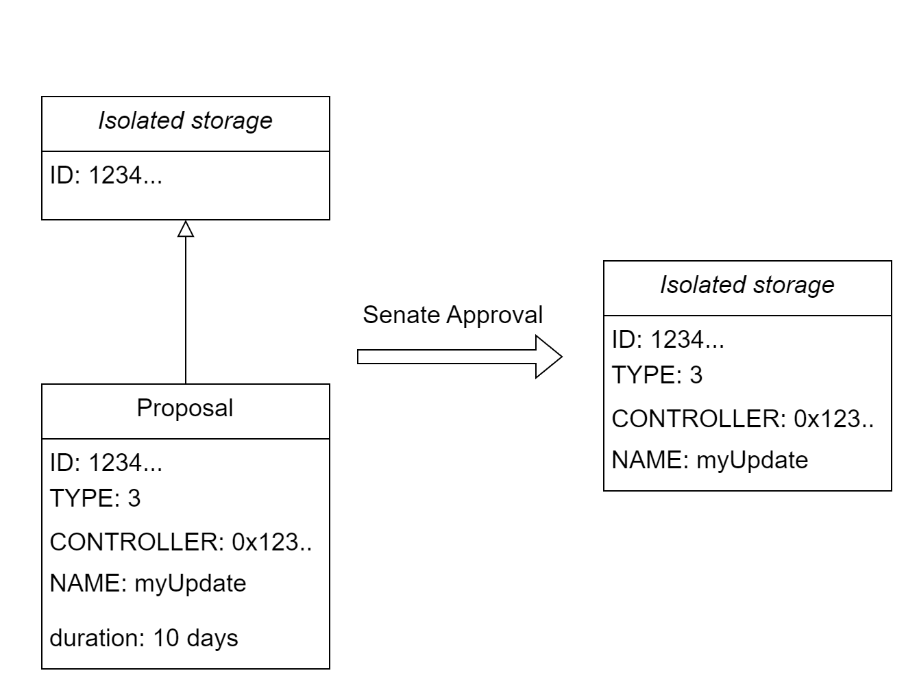

# 🤝 Dual Governance

## Building on top of the Isolated Storage

#### We learned that DataStore keeps different entities in isolated storage slots with different IDs.&#x20;

However, this functionality is nothing to be excited about without a mechanism to enforce this logic on protocol and contract upgrades.

#### Geode manages crucial parts of it's operation with 2 step verification:

1. Governance Proposals
2. Senate Approvals

This setup creates another safeguard for the users of The Staking Library.

## Proposals

A proposal is Geode Governance offering a change within the protocol to the Senate.&#x20;

Every proposals isolates an ID for DataStore.

After the Controller is chosen, no one else can touch to the given storage ID.

<figure><figcaption></figcaption></figure>


```solidity
  struct Proposal {
    address CONTROLLER;
    uint256 TYPE;
    bytes NAME;
    uint256 deadline;
  }
```


A Proposal has 4 parameters:

* **TYPE**: separates the proposals and related functionality between different ID types.
* **NAME**:important for ID generation through `DataStore.generateId()`
* **CONTROLLER**: the address that refers to the change that is proposed by given proposal ID.&#x20;
  * &#x20;This slot can refer to the controller of an id, a new implementation contract, a new Senate etc.
* **deadline**: refers to last timestamp until a proposal expires.


All TYPEs are reserved as `ID_TYPE` within  [`globals.sol`](../../developers/live-contracts/ethereum-v2/portal.sol/globals.sol.md)`.`


#### **There can be more TYPE reservations in the future.**

| ID\_TYPE | CONTROLLER                                                              |
| -------- | ----------------------------------------------------------------------- |
| 0        | <mark style="background-color:red;">NONE -unused</mark>                 |
| 1        | <mark style="color:green;">new senate address</mark>                    |
| 2        | <mark style="color:blue;">new implementation contract for Portal</mark> |
| 3        | <mark style="background-color:red;">GAP - unused</mark>                 |
| 4        | <mark style="color:green;">Controller of a Operator</mark>              |
| 5        | <mark style="color:purple;">Controller of a Pool</mark>                 |
| 21       | <mark style="color:blue;">Module: Withdrawal Contracts</mark>           |
| 31       | <mark style="color:blue;">Module: gETH interfaces</mark>                |
| 41       | <mark style="color:blue;">Module: Liquidity Pool</mark>                 |
| 42       | <mark style="color:blue;">Module: Liquidity Pool Token</mark>           |

### Governance

Currently, Governance is an internal ERC-20 token that is only owned by Geode Finance Developers and Treasury.

This internal ownership is a needed step to eliminate the risk of some attacks like Governance tak-over.

In the future, the Governance of Geode is supposed to be decentralized with the distribution of these tokens.

### Senate

Currently, Senate is a Multisig of Geode developers.&#x20;

But GeodeUtils Library includes a logic for changing the Senate, as well as an Election for it.

TYPE 1 proposals stand for Senate Elections.

However, the future of Senate will not be decided by elections, but with an other approach:

#### A Decentralized Senate with a weighted vote distribution:


[quadratic-weighted-senate-draft.md](../future-of-geode/further-decentralization/quadratic-weighted-senate-draft.md)


### Limited Upgradability

_TYPE 2_ proposals ensure Limited Upgradability on both Portal and Withdrawal Contracts.


[limited-upgradability.md](limited-upgradability.md)


### Onboarding Operators

_TYPE 4_ proposals stands for onboarding a new Node Operator to the Marketplace:

page link

### New Withdrawal Contract, gETH interface or Liquidity Pools

Other _TYPEs_ like _21, 31_ etc. stands for other important parameters of Portal like default Liquidity Pool or withdrawal Contract implementation.
