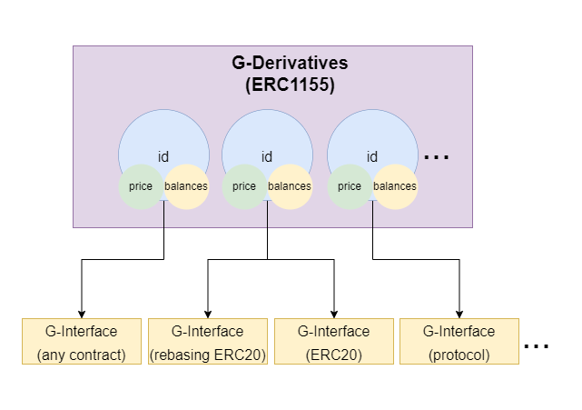

# G-Derivatives

### G-Derivatives are _Databases_ of <mark style="color:purple;">Balances</mark> and <mark style="color:purple;">Prices</mark> with extra <mark style="color:purple;">Scalability (interfaces).</mark>

<figure><figcaption><p>a special ERC1155 contract</p></figcaption></figure>

## <mark style="color:purple;">Balances</mark>

Acts as a **Database** for the amount of staked Ether that is represented by multiple Maintainers.

Balances for the depositors are tracked with a predetermined ID. IDs are the main separators of the different types of gETH, thus different maintainers.&#x20;

```solidity
mapping(uint256 => mapping(address => uint256)) private _balances;
```


Balances can be directly changed by **Interfaces.**



Anyone can disable the access of the interfaces by simply using the **avoidInterfaces** function!


## <mark style="color:purple;">Pricing</mark>

The balance of users, doesn’t change while the amount of the underlying tokens increase over time thanks to **Staking Rewards**.

Every different ID of gETH has a different _\_pricePerShare_ value.&#x20;

```solidity
mapping(uint256 => uint256) private _pricePerShare;
```

### **\_pricePerShare**

Basically, a variable that represents the equivalent of 1 gETH, in terms of underlying Ether.&#x20;

_\_pricePerShare_ is used by Geode on minting / burning operations, _and_ can be used by other contracts with peace of mind.&#x20;

It's value is updated by an Oracle.


[oracles](../../oracles/)



The **\_pricePerShare** parameter is one of the key components that supports DeFi.


## <mark style="color:purple;">Interfaces</mark>

> **Interfaces** are one of the most important concepts introduced by Geode.fi.

ERC-1155 tokens are not compatible within the DeFi ecosystem, thus they need to be mutated for public usage.&#x20;

**Every Derivative has a different use-case, depending on the represented Protocol, therefore it doesn’t come with a preset implementation.**

Interfaces are external contracts used to manage the underlying assets for different purposes. Unlocking infinite flexibility!


There can be multiple Interfaces for one gETH ID.

However, Portal doesn't currently allow that.


```solidity
mapping(uint256 => mapping(address => bool)) private _interfaces;
```


Transactions that are conducted with Interfaces can bypass the [ERC1155 requirements](https://eips.ethereum.org/EIPS/eip-1155#erc-1155-token-receiver), while other non-compatible contracts cannot receive them.


```solidity
  function _doSafeTransferAcceptanceCheck(...) private {
    if (to.isContract() && !isInterface(operator, id)) 
    {
    ...
    }
```

#### Learn more about other cool gETH functionalities:


[geth-vs-gavax.md](geth-vs-gavax.md)


#### See our case studies about some interfaces here: &#x20;


[current-interfaces.md](../../permissionless-configurable-staking-pools/current-interfaces.md)

