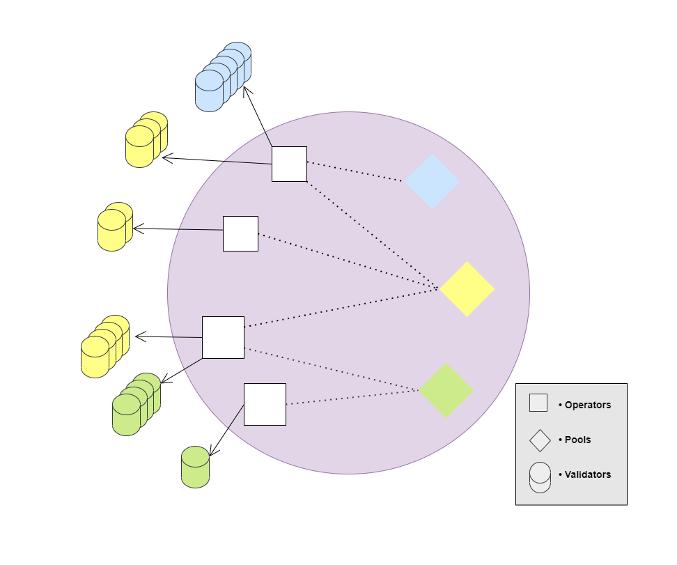

# Operator Marketplace

We've learned about the Global Standard that Geode has created to establish a trustless marketplace between Staking Pools and Node Operators:


[the-staking-library](../the-staking-library/)


Now, let's take a look at the underlying mechanism to see how this marketplace operates.&#x20;

## An Open Marketplace

<figure><figcaption></figcaption></figure>

#### Currently, there are 2 parties in this marketplace:&#x20;

* Configurable Staking Pools&#x20;
* Node Operators


<mark style="color:green;">In an open market that is regulated well, one's benefit is everyone's benefit.</mark>


### A validator's Lifecycle


[a-validators-lifecycle.md](a-validators-lifecycle.md)


### Regulating the Marketplace


[regulating-the-marketplace](regulating-the-marketplace/)


## 1. Configurable Staking Pools

| Profit                           | Expense  |
| -------------------------------- | -------- |
| Pool maintenance fee, up to 10%. | Gas cost |

### Staking pools are permissionless.&#x20;

Anyone can create a staking pool with Portal.

During the creation process, a pool is configured with certain options like maintainer, interface, maintenance fee, etc.&#x20;

Some of these configurations can be changed later by the controller.&#x20;

### Local and Global Security&#x20;

When a staking pool is created via Geode's Portal, it uses it's own isolated storage. This storage is protected from governance attacks by **Dual Governance**.&#x20;

After a validator is created, Portal holds no ownership on the pooled funds. It is simply transferred to a unique **Withdrawal Contract** guarded by the pool's controller.

#### Pool Maintenance Fee


[maintenance-fee.md](maintenance-fee.md)


## 2. Permissioned Node Operators

| Profit                            | Expenses              |
| --------------------------------- | --------------------- |
| Up to 10% of the staking rewards. | Operational expenses. |
| Up to 10% of the MEV.             | Gas cost.             |
| Up to 10% of the Block Rewards.   | Infrastructure cost.  |

Permissioned Node Operators are allowed to create and operate validators on behalf of the staking pools without any collateral.

#### Onboarding New Operators to the Marketplace


[onboarding-new-operators.md](onboarding-new-operators.md)


## 3. Permissionless Node Operators


<mark style="color:red;">This topic is currently under construction. Check out the Degen Operators (WIP) for further information.</mark>

