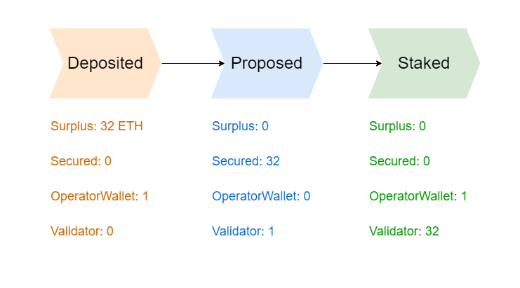

# 🟢 A Validator's Lifecycle

<figure><figcaption></figcaption></figure>

The controller of a Staking Pool can choose any set of Node Operators to work with.

* Staking Pools give an **allowance** to the Node Operators.&#x20;


**Allowance** represents the maximum number of validators to be created.


* Node Operators propose a validator with specific details.
* Every proposal requires 1 ETH from Operator, **which will be reimbursed upon activation.**


Pool Maintenance Fee, Operator Fee, and validator period is set on proposal.&#x20;

These parameters can not be changed afterwards.


* Oracle approves these proposals.
* Node Operators move 32 ETH from the staking pool to the approved validator.
* Validators are exited within the validator period.
* Fees are distributed after the validator withdrawal. However, with partial claiming


<mark style="color:green;">Staking Pool can change the allowance at any given point.</mark>&#x20;

<mark style="color:green;">As old validators are exited, their stake is redistributed as per the allowance.</mark>

